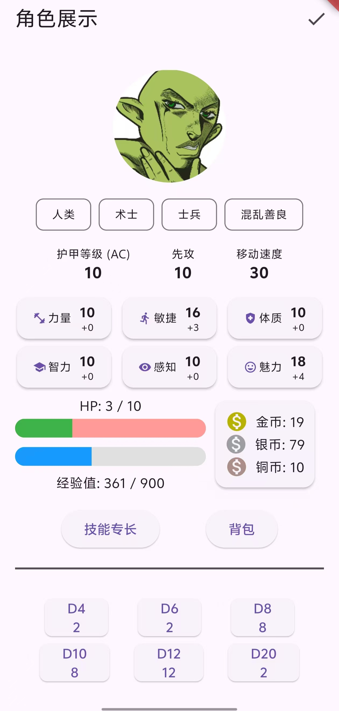
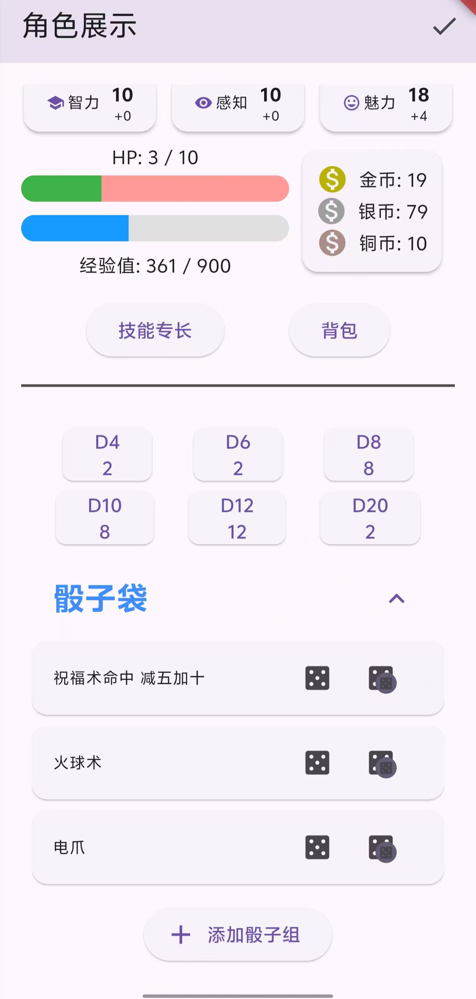
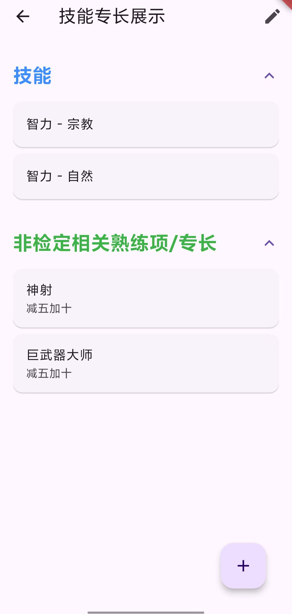
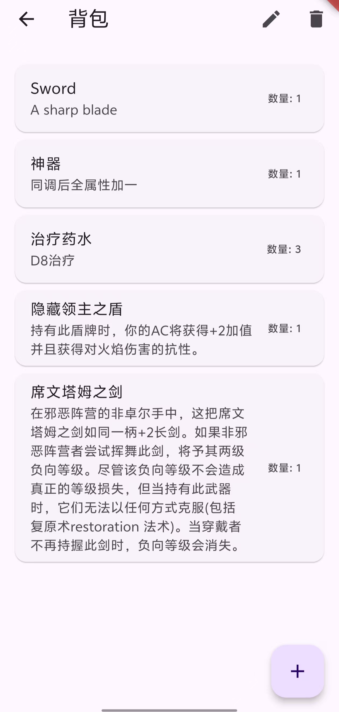

# dnd_character_sheet

A Dungeons & Dragons character sheet app built with Flutter. Designed to replace paper character sheets for easier management and added convenience during tabletop role-playing games.

  
  
  
  

## TODO

- [x] Data persistence storage
- [ ] Proficiency and corresponding advantage/disadvantage checks
- [ ] Campaign notes
- [ ] Spellbook
- [ ] Quick consumables bar